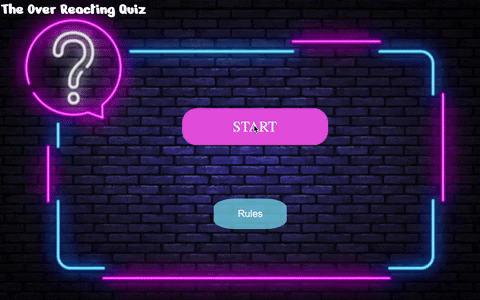

# CHC Quiz Game

<!--  -->

## Installation

In order to run our project you need first to install all the necessary dependencies: 

- First `git clone` to get the path of your choice
- Then `npm install` to get the required dependencies
- Finally `npm start` will get the app to run on your browser

## Technologies

HTML, CSS, JavaScript, React, Redux, Jest, Enjyme, Netlify

## Development Goals

- Users should be able start a game with a limited number of players from the same computer
    - Added the ablity to dynamicaly change the number of players
    - Players can choose their own names to be displayed while playing
- Users should take it in turns to answer trivia questions and after a set number of turns a winner should be declared.
    - Number of turns are equal to the number of questions
    - Score is dynamicaly updated while playing
    - Winner gets a cookie! *(no actual cookie is included with this application)*
- Users should be able to choose the level and topic for their quiz game
    - Added the option for 3 difficulty levels
    - Increased the number of categories available to choose from